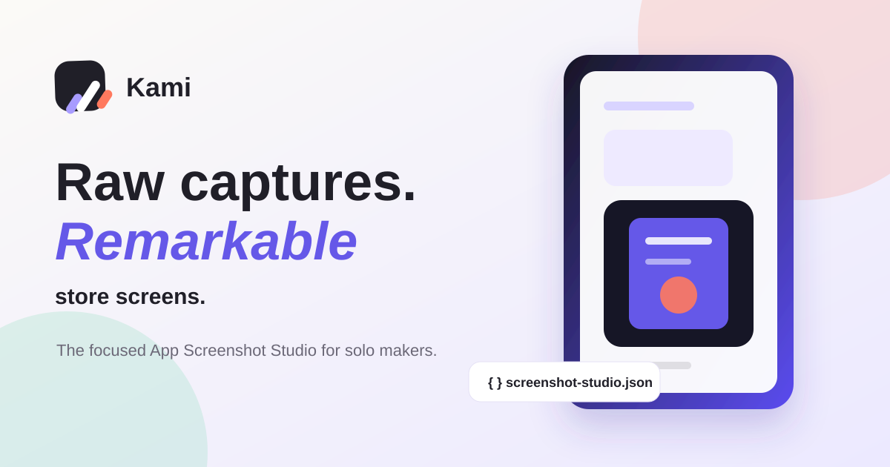

# Kami

[](https://github.com/janasco/kami/actions/workflows/ci.yml)
[](https://vite.dev)
[](https://react.dev)
[](https://www.typescriptlang.org/)
[](https://nodejs.org)

**App Screenshot Studio** — turn raw app captures into polished, cohesive screenshots without a heavyweight design tool.

Kami is a browser-based editor for solo developers and creators. Compose a screenshot story, refine its presentation, and download a ZIP of PNGs at exact dimensions for supported App Store and Google Play targets.

## Demo

- [Open the Kami landing page](https://janasco.github.io/kami/)
- [Open the editor](https://janasco.github.io/kami/editor)
- [Project repository](https://github.com/janasco/kami)



Kami prepares image assets to the selected output dimensions; it does not guarantee App Store or Google Play review approval.

## Features

- Import PNG, JPG, and WebP screenshots, app icons, and background images.
- Build individual or connected panoramic screenshot stories with reusable layouts, themes, and iPhone, Android, or frameless previews.
- Edit copy and layer visibility, colors, opacity, position, scale, rotation, size, and flips with direct canvas controls.
- Preview English, Spanish, and Arabic copy, including RTL layouts.
- Save browser drafts with IndexedDB when available and open or save the portable `screenshot-studio.json` project.
- Export client-side PNG bundles as ZIP files at the selected profile dimensions.
- Use templates, a demo project, undo/redo, keyboard shortcuts, and an in-editor guide.

## Local development

Kami uses Node.js 20+, Vite, React, and TypeScript. The initial development setup does not require secrets.

```bash
cp .env.example .env
npm install
npm run dev
```

Run the checks used by CI:

```bash
npm run check:project
npm test
npm run build
```

Preview the production bundle locally with `npm run preview`. The app exposes `/` for the landing page and `/editor` for the editor. A production host must provide an SPA fallback to `index.html` so direct visits to `/editor` resolve to the app.

## Project format

Project state belongs in [`screenshot-studio.json`](./screenshot-studio.json), which is intentionally not ignored so it can be reviewed and tracked in Git. The format is documented in [`docs/project-file.md`](./docs/project-file.md) and validated against [`schemas/screenshot-studio.v1.json`](./schemas/screenshot-studio.v1.json).

The project document keeps large image binaries outside its portable JSON structure. Unknown fields are preserved where supported, and schema changes should include validation and migration coverage.

## Export profiles

The current renderer supports these PNG output targets:

- App Store portrait: `1242 × 2688` and `1125 × 2436`.
- Google Play phone portrait: `1080 × 1920`.
- Google Play 7-inch tablet: `1200 × 1920` portrait and `1920 × 1200` landscape.
- Google Play feature graphic: `1024 × 500`.

Select a profile in the editor to export a ZIP containing one PNG per slide at that profile's dimensions. Export preflight reports blocking and non-blocking issues before export.

## Contributing

Please read [`CONTRIBUTING.md`](./CONTRIBUTING.md) before opening a pull request. Keep changes focused, preserve portability of the project file, document user-facing behavior, and do not commit secrets, private assets, or generated export bundles.

## License

A license will be selected before the first public release.
